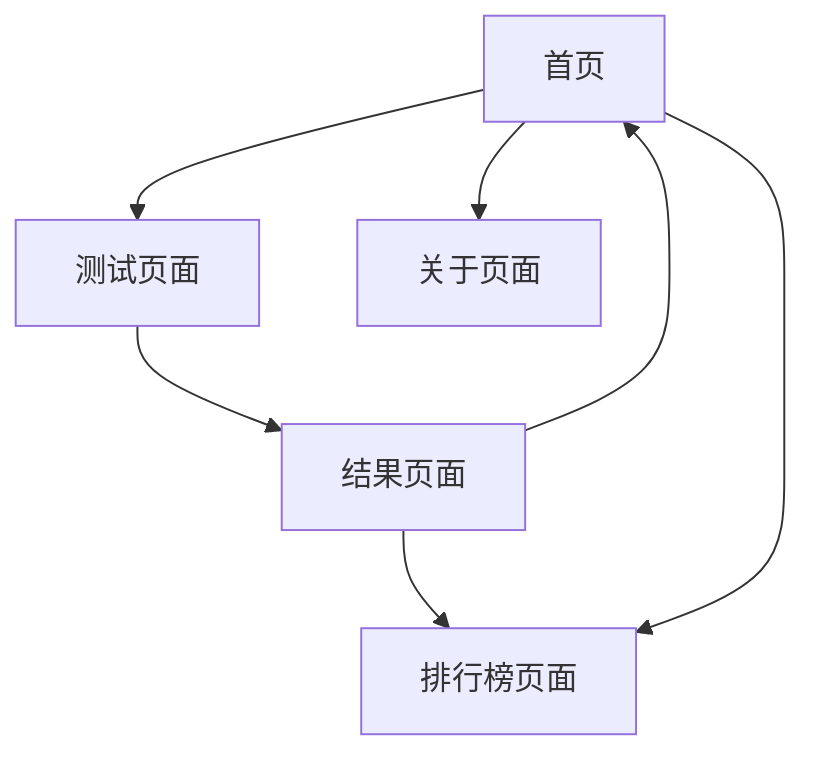

# Human Benchmark 中文版 - 产品需求文档

## 1. 产品概述

一个类似Human Benchmark的中文/英语双语反应测试网站，专为移动端优化设计，提供多种认知能力测试项目。用户可以测试反应速度、记忆力、注意力等能力，并查看实时排名。产品目标是创建一个简洁易用、适合在手机QQ群中传播分享的测试平台。

## 2. 核心功能

### 2.1 用户体验

完全匿名游戏体验，无需注册或登录：
- 所有用户均为匿名用户，通过浏览器指纹进行识别
- 可进行所有测试项目，查看实时排名
- 本地保存个人历史记录，参与全球排行榜
- 排行榜显示匿名标识（如：用户001、用户002等）

### 2.2 功能模块

我们的Human Benchmark网站包含以下主要页面：
1. **首页**：项目展示区、语言切换、快速开始按钮
2. **测试页面**：各项测试的执行界面、实时反馈、结果展示
3. **排行榜页面**：全球排名、个人历史记录
4. **关于页面**：项目介绍、使用说明

### 2.3 页面详情

| 页面名称 | 模块名称 | 功能描述 |
|----------|----------|----------|
| 首页 | 项目展示区 | 展示所有测试项目卡片，包括反应速度、数字记忆、视觉记忆、打字速度等 |
| 首页 | 语言切换 | 中文/英文切换按钮，保存用户语言偏好 |
| 首页 | 导航栏 | 简洁的顶部导航，包含首页、排行榜、关于等链接 |
| 测试页面 | 测试执行区 | 根据不同测试类型显示相应的交互界面（点击、记忆、输入等） |
| 测试页面 | 实时反馈 | 测试过程中的视觉和文字反馈，进度指示 |
| 测试页面 | 结果展示 | 测试完成后显示分数、排名、历史对比 |
| 排行榜页面 | 全球排名 | 各项测试的全球前100名排行榜 |
| 排行榜页面 | 个人记录 | 匿名用户的历史最佳成绩（本地存储） |
| 关于页面 | 项目介绍 | 网站功能说明、测试项目介绍 |

## 3. 核心流程

**主要用户流程：**
用户访问首页 → 选择测试项目 → 阅读测试说明 → 开始测试 → 完成测试 → 查看结果和排名 → 选择继续测试或分享结果

**数据统计流程：**
测试完成 → 验证10分钟限制（基于IP+指纹） → 记录成绩到Supabase → 更新排行榜 → 显示匿名排名

## 4. 用户界面设计

### 4.1 设计风格

- **主色调**：白色 (#FFFFFF) 和浅灰色 (#F5F5F5)
- **辅助色**：深灰色 (#333333) 用于文字，蓝色 (#007AFF) 用于强调
- **按钮样式**：圆角矩形，简洁扁平化设计
- **字体**：中文使用苹方/思源黑体，英文使用 San Francisco/Roboto，主要字号 16px-20px
- **布局风格**：卡片式设计，顶部导航，适合触摸操作的大按钮
- **图标风格**：简洁的线性图标，统一的视觉语言

### 4.2 页面设计概览

| 页面名称 | 模块名称 | UI元素 |
|----------|----------|--------|
| 首页 | 项目展示区 | 网格布局的测试项目卡片，每个卡片包含图标、标题、简短描述和开始按钮 |
| 首页 | 语言切换 | 右上角的中/EN切换开关，使用滑动开关样式 |
| 测试页面 | 测试执行区 | 全屏沉浸式设计，根据测试类型显示不同的交互元素（按钮、输入框、图形等） |
| 测试页面 | 结果展示 | 居中的成绩卡片，包含分数、排名、进度条和分享按钮 |
| 排行榜页面 | 排名列表 | 简洁的列表设计，显示排名、用户名、分数，当前用户高亮显示 |

### 4.3 响应式设计

网站采用移动端优先的响应式设计，主要适配手机屏幕（320px-414px），同时兼容平板和桌面端。所有交互元素针对触摸操作优化，按钮最小尺寸44px，适合手指点击。