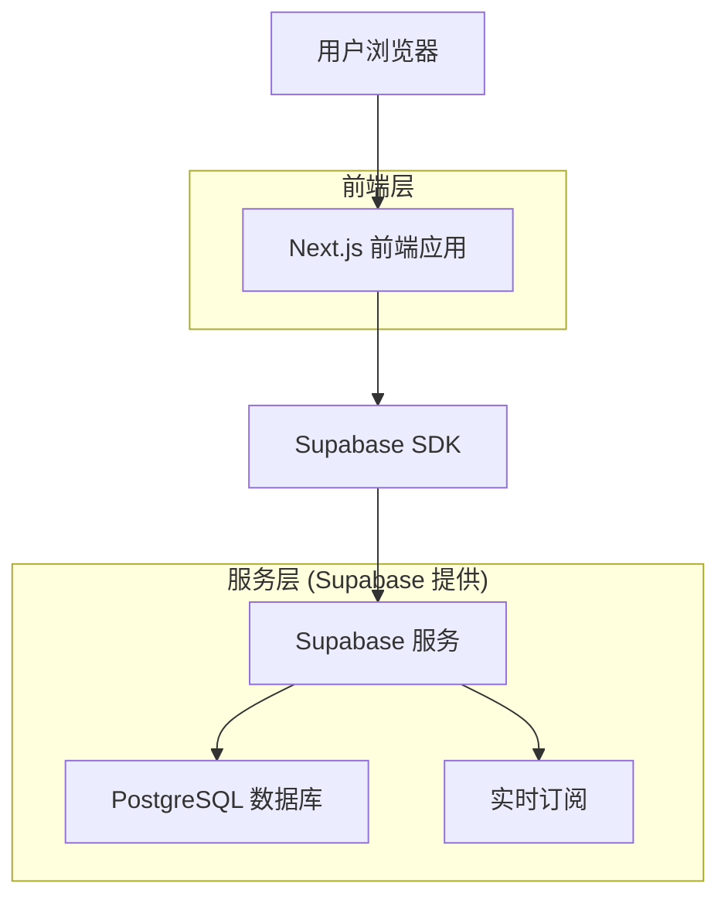
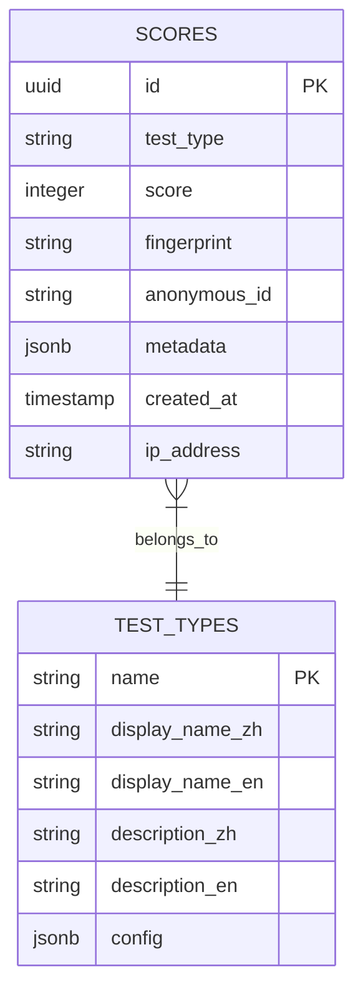

# Human Benchmark 中文版 - 技术架构文档

## 1. 架构设计



## 2. 技术描述

- **前端**: Next.js@14 + TypeScript + Tailwind CSS + Framer Motion
- **后端**: Supabase (PostgreSQL + 实时API)
- **部署**: Vercel (前端) + Supabase Cloud (后端)
- **国际化**: next-i18next
- **匿名识别**: IP地址 + 浏览器指纹

## 3. 路由定义

| 路由 | 用途 |
|------|------|
| / | 首页，显示所有测试项目 |
| /test/[testType] | 动态测试页面，支持反应速度、数字记忆、视觉记忆等 |
| /leaderboard | 排行榜页面，显示各项测试的全球排名 |
| /leaderboard/[testType] | 特定测试项目的详细排行榜 |
| /about | 关于页面，项目介绍和使用说明 |
| /stats | 匿名统计页面，本地历史记录 |

## 4. API 定义

### 4.1 核心 API

**成绩提交接口**
```
POST /api/scores/submit
```

请求参数:
| 参数名 | 参数类型 | 是否必需 | 描述 |
|--------|----------|----------|------|
| testType | string | true | 测试类型 (reaction, memory, typing等) |
| score | number | true | 测试分数 |
| fingerprint | string | true | 浏览器指纹 |
| metadata | object | false | 测试详细数据 |

响应:
| 参数名 | 参数类型 | 描述 |
|--------|----------|-----|
| success | boolean | 提交是否成功 |
| rank | number | 当前排名 |
| anonymousId | string | 匿名用户标识 |

**排行榜查询接口**
```
GET /api/leaderboard/[testType]
```

请求参数:
| 参数名 | 参数类型 | 是否必需 | 描述 |
|--------|----------|----------|------|
| limit | number | false | 返回记录数量，默认100 |
| offset | number | false | 分页偏移量 |

响应:
| 参数名 | 参数类型 | 描述 |
|--------|----------|-----|
| rankings | array | 排行榜数据 (显示为匿名用户) |
| total | number | 总记录数 |
| currentRank | number | 当前匿名用户排名 |

## 5. 数据模型

### 5.1 数据模型定义



### 5.2 数据定义语言


**成绩表 (scores)**
```sql
-- 创建成绩表
CREATE TABLE scores (
    id UUID PRIMARY KEY DEFAULT gen_random_uuid(),
    test_type VARCHAR(50) NOT NULL,
    score INTEGER NOT NULL,
    fingerprint VARCHAR(255) NOT NULL,
    anonymous_id VARCHAR(50) NOT NULL,
    metadata JSONB DEFAULT '{}',
    ip_address INET,
    created_at TIMESTAMP WITH TIME ZONE DEFAULT NOW()
);

-- 创建索引
CREATE INDEX idx_scores_test_type ON scores(test_type);
CREATE INDEX idx_scores_fingerprint ON scores(fingerprint);
CREATE INDEX idx_scores_anonymous_id ON scores(anonymous_id);
CREATE INDEX idx_scores_created_at ON scores(created_at DESC);
CREATE INDEX idx_scores_score ON scores(test_type, score DESC);
CREATE INDEX idx_scores_ip_address ON scores(ip_address);

-- 设置权限
GRANT SELECT ON scores TO anon;
GRANT ALL PRIVILEGES ON scores TO authenticated;

-- 创建防刷分策略 (10分钟限制)
CREATE OR REPLACE FUNCTION check_score_limit()
RETURNS TRIGGER AS $$
BEGIN
    -- 检查同一IP+指纹在10分钟内是否已提交相同测试类型的成绩
    IF EXISTS (
        SELECT 1 FROM scores 
        WHERE (ip_address = NEW.ip_address OR fingerprint = NEW.fingerprint)
        AND test_type = NEW.test_type 
        AND created_at > NOW() - INTERVAL '10 minutes'
    ) THEN
        RAISE EXCEPTION '同一测试项目10分钟内只能提交一次成绩';
    END IF;
    
    -- 自动生成匿名ID (如果为空)
    IF NEW.anonymous_id IS NULL OR NEW.anonymous_id = '' THEN
        NEW.anonymous_id := 'User' || LPAD((SELECT COUNT(*) + 1 FROM scores WHERE fingerprint = NEW.fingerprint)::text, 3, '0');
    END IF;
    
    RETURN NEW;
END;
$$ LANGUAGE plpgsql;

CREATE TRIGGER trigger_check_score_limit
    BEFORE INSERT ON scores
    FOR EACH ROW
    EXECUTE FUNCTION check_score_limit();
```

**测试类型表 (test_types)**
```sql
-- 创建测试类型表
CREATE TABLE test_types (
    name VARCHAR(50) PRIMARY KEY,
    display_name_zh VARCHAR(100) NOT NULL,
    display_name_en VARCHAR(100) NOT NULL,
    description_zh TEXT,
    description_en TEXT,
    config JSONB DEFAULT '{}',
    is_active BOOLEAN DEFAULT true,
    created_at TIMESTAMP WITH TIME ZONE DEFAULT NOW()
);

-- 设置权限
GRANT SELECT ON test_types TO anon;
GRANT ALL PRIVILEGES ON test_types TO authenticated;

-- 初始化测试类型数据
INSERT INTO test_types (name, display_name_zh, display_name_en, description_zh, description_en, config) VALUES
('reaction', '反应速度', 'Reaction Time', '测试你的反应速度', 'Test your reaction time', '{"unit": "ms", "lower_is_better": true}'),
('memory', '数字记忆', 'Number Memory', '测试你能记住多少位数字', 'Test how many digits you can remember', '{"unit": "digits", "lower_is_better": false}'),
('visual', '视觉记忆', 'Visual Memory', '测试你的视觉记忆能力', 'Test your visual memory', '{"unit": "level", "lower_is_better": false}'),
('typing', '打字速度', 'Typing Speed', '测试你的打字速度', 'Test your typing speed', '{"unit": "wpm", "lower_is_better": false}'),
('sequence', '序列记忆', 'Sequence Memory', '测试你的序列记忆能力', 'Test your sequence memory', '{"unit": "level", "lower_is_better": false}');
```

**排行榜视图**
```sql
-- 创建排行榜视图
CREATE OR REPLACE VIEW leaderboard AS
SELECT 
    s.test_type,
    s.anonymous_id,
    s.fingerprint,
    s.score,
    s.created_at,
    ROW_NUMBER() OVER (PARTITION BY s.test_type ORDER BY 
        CASE 
            WHEN tt.config->>'lower_is_better' = 'true' THEN s.score 
        END ASC,
        CASE 
            WHEN tt.config->>'lower_is_better' = 'false' THEN s.score 
        END DESC
    ) as rank
FROM scores s
JOIN test_types tt ON s.test_type = tt.name
WHERE s.score > 0;

-- 设置权限
GRANT SELECT ON leaderboard TO anon;
```